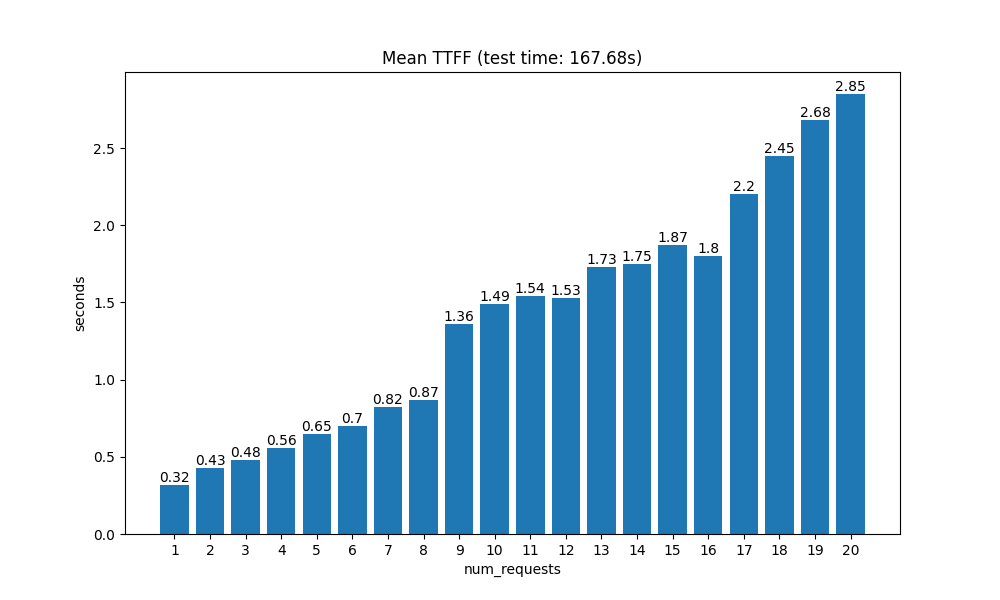
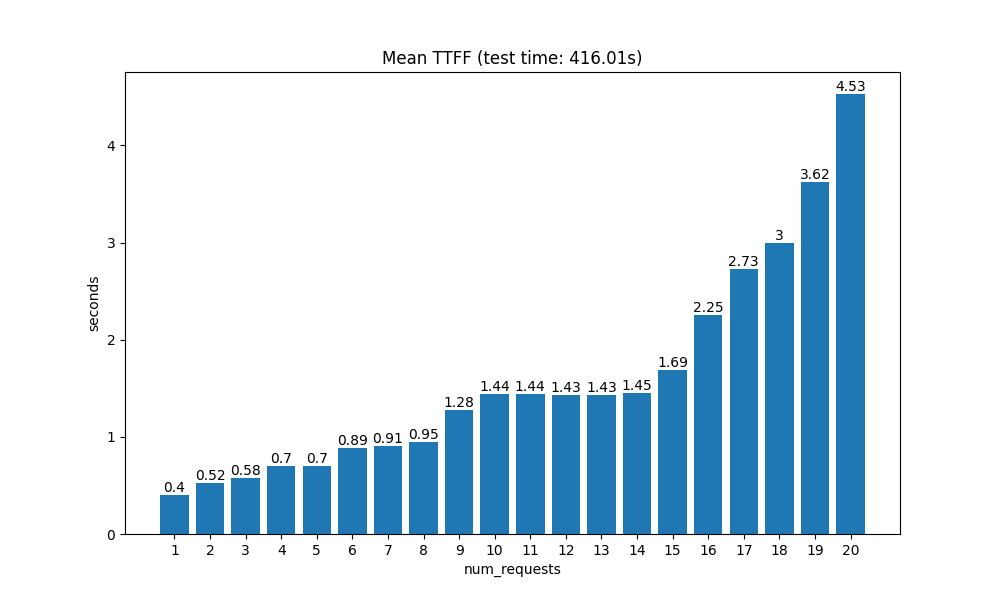

# CosyVoice2 - Lightning

## Introduction

参考 [CosyVoice2](https://github.com/FunAudioLLM/CosyVoice) 修改的 CosyVoice2 Websocket API，支持以下特性：

1. 使用 `vLLM 0.7` 加速推理；
2. 支持流式输入和流式输出；
3. 支持多格式音频（opus、pcm、wav、mp3、flac、aac、m4a、wav，默认是 wav）和多采样率输出；
4. 支持克隆音色；
5. 支持使用指令文本控制语音生成；
6. 支持保存和加载已克隆音色。

## Updates

- [2025/09/03] 新增支持 `vLLM 0.8`、`vLLM 0.9` 和 `SGLang`；提高长文本生成质量；简化部署；同步官方代码。

## Demo

- 哪吒

  https://github.com/user-attachments/assets/417104a4-615e-4b64-90af-4738cece6d49

- 邻家女孩

  https://github.com/user-attachments/assets/b6e86641-b7d2-453e-8723-e05106c1d57c

- 小美

  https://github.com/user-attachments/assets/d9b5510e-9e52-4a45-81c8-4e1ac5769a59

- 甄嬛

  https://github.com/user-attachments/assets/91759352-503c-4e54-bef6-31acac2338d3

- 阳光甜美

  https://github.com/user-attachments/assets/87695d78-1218-44f9-b181-d8385e54efb3

- 提莫

  https://github.com/user-attachments/assets/61dda736-0e2f-4398-9207-b802f1b9ede4

## TTFF

> 以下测试使用 `SGLang` 作为后端。

- 单句话

  

- 短段落

  

## Usage

### Setup

1. 拉取 `Matcha-TTS` 仓库

   ```bash
   git submodule update --init --recursive
   ```

2. 安装 `Python` 环境和依赖

   ```bash
   conda create -n cosyvoice -y python=3.10
   conda activate cosyvoice
   # 若使用 vllm 0.7 版本，执行命令：
   pip install -r requirements.txt
   # 若使用 vllm 0.8 版本，执行命令：
   pip install -r requirements.vllm_0_8.txt
   # 若使用 vllm 0.9 版本，执行命令：
   pip install -r requirements.vllm_0_9.txt
   # 若使用 sglang 0.4.10.post2 版本，执行命令：
   pip install -r requirements.sglang.txt
   ```

3. 安装 `sox` 库

   ```bash
   # On Ubuntu
   apt-get install sox libsox-dev
   # On CentOS
   yum install sox sox-devel
   ```

4. 安装 `ttsfrd` 库（可选）

   > 如果使用 `wetext` 归一化文本，则可以跳过该步骤。

   ```bash
   git clone https://www.modelscope.cn/iic/CosyVoice-ttsfrd.git
   cd ./CosyVoice-ttsfrd
   unzip resource.zip -d .
   pip install ttsfrd_dependency-0.1-py3-none-any.whl
   pip install ttsfrd-0.4.2-cp310-cp310-linux_x86_64.whl
   ```
   编辑环境参数文件 `api/.env` 和 `demo/run_demo.sh` 中的 `TTSFRD_RESOURCE_PATH` 为 `CosyVoice-ttsfrd/resource` 的路径。

   或者安装其他版本的 ttsfrd：

   ```bash
   git clone https://www.modelscope.cn/speech_tts/speech_kantts_ttsfrd.git
   cd speech_kantts_ttsfrd/
   unzip resource.zip -d .
   pip install ttsfrd-0.3.9-cp310-cp310-linux_x86_64.whl
   ```

5. 下载模型文件

   - 从 [iic/CosyVoice2-0.5B - ModelScope](https://www.modelscope.cn/models/iic/CosyVoice2-0.5B)（兼容 `20250819` 前的版本）下载模型文件。

   - 编辑 `api/.env` 和 `demo/run_demo.sh` 中 TTS 模型文件的路径。

6. 修改 CUDA 架构版本

    - 使用 `python -c "import torch; print(torch.cuda.get_device_capability())` 查看你的 CUDA 架构版本。

    - 修改 `api/.env` 和 `run_demo.sh` 中的 `TORCH_CUDA_ARCH_LIST` 为你的 CUDA 架构版本。比如上面命令的输出是 `(8, 9)`，则修改为 `TORCH_CUDA_ARCH_LIST=8.9`。

7. 其他问题处理

   - `AttributeError: 'ClassDef' object has no attribute 'type_params'`

     安装 modelscope-1.14.0：`pip install modelscope==1.14.0`
   
   - `OSError: /etc/miniconda3/envs/cosyvoice2/bin/../lib/libstdc++.so.6: version `GLIBCXX_3.4.32' not found (required by /root/.cache/flashinfer/89/cached_ops/sampling/sampling.so)`

     删除 `/etc/miniconda3/envs/cosyvoice2/bin/../lib/libstdc++.so.6`。

### Gradio Demo

> 启动演示 Demo，包括克隆和指令控制。

```bash
cd demo
sh run_demo.sh
```

### API

> 启动 API 服务，由 Websocket 提供流式生成。具体接口参考 [API docs](api/README.md)。

```bash
cd api
sh run_server.sh
python test.py
```
